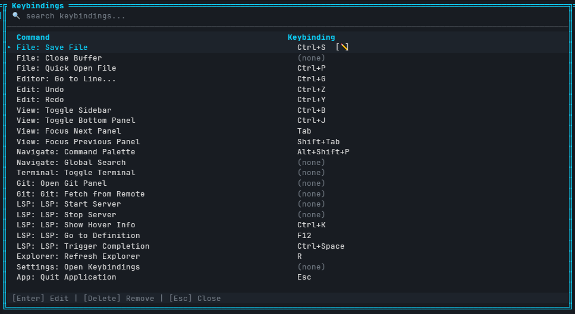

<div align="center">

# Codex-Snabb

> **IDE TUI en Rust — RAM/CPU first.**
> Performance y predictibilidad como requisitos de diseño, no como afterthought.

<p>
  
  
  
  
  
  
</p>

<br/>



</div>

---

## ✨ ¿Qué es Codex-Snabb?

Un **IDE TUI en Rust** que lleva a la terminal una experiencia de trabajo con layout estilo VS Code (editor central, explorer, panel inferior, command palette), sin el costo de un entorno gráfico pesado y con una curva de aprendizaje baja.

No es "meter VS Code en una TTY". Es una **TUI seria para trabajo diario**, con event loop explícito, state particionado y budgets de memoria/CPU documentados desde el diseño.

---

## 🎯 ¿Por qué existe Codex-Snabb?

Si ya hay Helix, Zed, Neovim, kakoune — ¿para qué otro editor? Porque ninguno cubre exactamente este hueco:

| Herramienta | Fuerte en… | Débil en… |
|---|---|---|
| **Neovim / LazyVim** | Potencia, extensibilidad infinita | Curva de aprendizaje vertical — modal editing obligatorio |
| **Helix** | Multi-cursor, LSP integrado | Keybindings no estándar, ecosistema joven |
| **Zed** | Performance bruta, colaboración | Requiere GUI — no corre en TTY / SSH puro |
| **VS Code (WSL/Tunnel)** | Ecosistema masivo | RAM/CPU pesados, requiere runtime Electron |
| **Codex-Snabb** | Layout familiar tipo VS Code **en TUI**, event loop explícito, keybindings editables, budgets de RAM documentados | WIP — pre-alpha |

**El hueco que busca cubrir:** UX familiar + bajo costo de recursos + sin dependencia de GUI + curva de aprendizaje baja.

---

## 🚦 Status

**Pre-alpha** — desarrollo activo. Lo que tiene keybinding asignado en la tabla de abajo es funcional; lo marcado como `(none)` existe en la paleta pero todavía sin binding / feature parcial.

---

## 🚀 Getting Started

### Requisitos

- **Rust** `1.85+` (edition 2024)
- **Terminal** con soporte UTF-8 y 256 colores — [Windows Terminal](https://github.com/microsoft/terminal), [WezTerm](https://wezfurlong.org/wezterm/), [Alacritty](https://alacritty.org/), [Kitty](https://sw.kovidgoyal.net/kitty/), [iTerm2](https://iterm2.com/)
- **Git** (opcional, para features de Git integration)

### Build & run

```bash
git clone https://github.com/kockono/Codex-Snabb.git
cd Codex-Snabb
cargo run --release
```

Para desarrollo con logs verbosos:

```bash
RUST_LOG=debug cargo run
```

---

## 🧩 Features

- Editor central con **syntax highlighting** (tree-sitter + syntect fallback)
- **Command palette** buscable (`Alt+Shift+P`)
- **Quick open file** (`Ctrl+P`)
- **Go to line** (`Ctrl+G`)
- **Undo / Redo** stack
- **LSP integration** — hover info, go to definition, completions
- **Explorer** con refresh manual
- **Keybindings panel** buscable con edit/remove en runtime
- Panel lateral y panel inferior con toggle
- Navegación entre paneles con Tab / Shift+Tab
- Terminal PTY integrada (portable-pty, cross-platform)
- Git panel (en construcción)

---

## ⌨️ Keybindings

| Comando | Shortcut | Estado |
|---|---|---|
| File: Save File | `Ctrl+S` | ✅ |
| File: Close Buffer | *(none)* | 🔲 |
| File: Quick Open File | `Ctrl+P` | ✅ |
| Editor: Go to Line | `Ctrl+G` | ✅ |
| Edit: Undo | `Ctrl+Z` | ✅ |
| Edit: Redo | `Ctrl+Y` | ✅ |
| View: Toggle Sidebar | `Ctrl+B` | ✅ |
| View: Toggle Bottom Panel | `Ctrl+J` | ✅ |
| View: Focus Next Panel | `Tab` | ✅ |
| View: Focus Previous Panel | `Shift+Tab` | ✅ |
| Navigate: Command Palette | `Alt+Shift+P` | ✅ |
| Navigate: Global Search | *(none)* | 🔲 |
| Terminal: Toggle Terminal | *(none)* | 🔲 |
| Git: Open Git Panel | *(none)* | 🔲 |
| Git: Fetch from Remote | *(none)* | 🔲 |
| LSP: Start Server | *(none)* | 🔲 |
| LSP: Stop Server | *(none)* | 🔲 |
| LSP: Show Hover Info | `Ctrl+K` | ✅ |
| LSP: Go to Definition | `F12` | ✅ |
| LSP: Trigger Completion | `Ctrl+Space` | ✅ |
| Explorer: Refresh | `R` | ✅ |
| Settings: Open Keybindings | *(none)* | 🔲 |
| App: Quit | `Esc` | ✅ |

> Los keybindings son **editables en runtime** desde `Settings: Open Keybindings`.

---

## 📊 Performance budgets

Metas explícitas — no "optimización después":

| Métrica | Target |
|---|---|
| Idle RAM (sin LSP) | `< 85 MB` |
| RAM en uso normal | `< 100 MB` |
| Input-to-render | target `< 20 ms` · hard limit `< 35 ms` |
| CPU idle | `~0–1%` |

**Principios operativos:**

- Nada costoso corre por defecto
- Search / Git / LSP deben ser cancelables (cada `tokio::spawn` lleva `CancellationToken`)
- Terminal con scrollback acotado
- Theming con palette precomputada
- Observabilidad (`tracing`) desde el inicio, no al final
- Cero allocations dentro del render loop

---

## 🏗️ Arquitectura (resumen)

Flujo central event-driven:

```text
crossterm input → Action → reducer/store → Effects → workers → Event → invalidation → render
```

**Decisiones clave:**

- **UI thread único** para input, reducción de estado y scheduling de render
- **Workers dedicados** para I/O y subsistemas pesados (LSP, search, git, pty)
- **Message passing tipado** entre acciones, efectos y eventos
- **Estado particionado** (`ui`, `workspace`, `editor`, `search`, `git`, `terminal`, `lsp`)
- **Render por regiones/paneles** — no redraw conceptual completo
- **Virtualización por viewport** (editor, explorer, search, terminal)
- **Cómputo fuera del render** — allocations pre-computadas y cacheadas
- **Colas acotadas + cancelación explícita** como regla de diseño

**→ Detalle completo en [`architecture.md`](./architecture.md).**

---

## 🎨 Syntax highlighting

Motor principal: **tree-sitter** (parsing incremental, <1ms por keystroke).
Fallback automático: **syntect** para lenguajes sin grammar tree-sitter compatible con el core `^0.25`.

| Lenguaje | Extensiones | Motor | Estado |
|---|---|---|---|
| Rust | `.rs` | tree-sitter | ✅ |
| TypeScript | `.ts`, `.tsx` | tree-sitter | ✅ |
| Go | `.go` | tree-sitter | ✅ |
| JSON | `.json` | tree-sitter | ✅ |
| CSS | `.css` | tree-sitter | ✅ |
| Bash / Shell | `.sh`, `.bash` | tree-sitter | ✅ |
| Python | `.py` | syntect | 🔄 Pendiente grammar |
| JavaScript | `.js`, `.jsx` | syntect | 🔄 Pendiente grammar |
| C | `.c`, `.h` | syntect | 🔄 Pendiente grammar |
| C++ | `.cpp`, `.hpp` | syntect | 🔄 Pendiente grammar |
| HTML | `.html`, `.htm` | syntect | 🔄 Pendiente grammar |
| TOML | `.toml` | syntect | 🔄 Grammar viejo (^0.20) |
| YAML | `.yml`, `.yaml` | syntect | 🔄 Grammar viejo (^0.19) |
| Markdown | `.md` | syntect | 🔄 Grammar viejo (^0.20) |
| Otros | `*` | syntect | ✅ Fallback automático |

> Los lenguajes en estado 🔄 funcionan con colores vía syntect — solo sin parsing incremental. Se migrarán a tree-sitter a medida que sus grammars actualicen compatibilidad con el core `^0.25`.

---

## 🧰 Stack técnico

- **Rust** (`edition = 2024`)
- **ratatui** + **crossterm** — rendering TUI e input handling
- **tokio** + **tokio-util** — runtime async con cancellation tokens
- **portable-pty** — terminal integrada cross-platform
- **tree-sitter** + **syntect** — syntax highlighting incremental con fallback
- **lsp-types** — integración Language Server Protocol
- **regex** + **globset** — búsqueda y filtros
- **tracing** + **tracing-subscriber** — observabilidad
- **anyhow** + **thiserror** — error handling disciplinado
- **serde** + **serde_json** — configuración y persistencia
- **rfd** — diálogos nativos de selección de archivos

Detalle completo: [`Cargo.toml`](./Cargo.toml).

---

## 🗺️ Roadmap

- [x] Event loop + state particionado + render por paneles
- [x] Syntax highlighting tree-sitter + syntect fallback
- [x] Command palette + keybindings editables en runtime
- [x] LSP basics (hover, go-to-def, completion)
- [x] Explorer con refresh manual
- [ ] Global search + replace
- [ ] Git panel completo (status, diff, stage, commit, fetch)
- [ ] Terminal toggle con keybinding default
- [ ] Themes / palette configurable
- [ ] Multi-workspace
- [ ] LSP manual start/stop con keybindings

**→ Detalle en [`roadmap.md`](./roadmap.md) · breakdown de épicas en [`tasks.md`](./tasks.md).**

---

## 🤝 Contributing

Contribuciones bienvenidas — issues, PRs y sugerencias.

Antes de escribir código Rust, revisá las **reglas inviolables** en [`CLAUDE.md`](./CLAUDE.md): ownership, allocations, cancellation, y budgets de RAM/CPU no negociables.

---

## 📄 License

**MIT License** — ver [`LICENSE`](./LICENSE).

Copyright © 2026 Chris Cobos.
