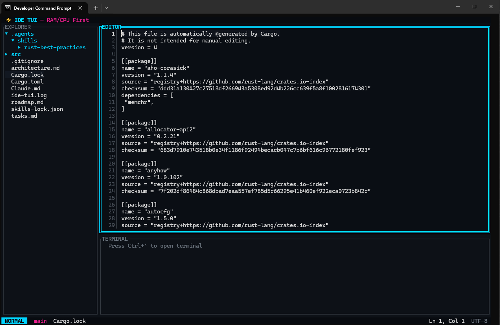

# IDE-Rust

> IDE TUI en Rust, inspirado en flujos tipo VS Code, con una restricción central NO negociable: **RAM/CPU first**.



## ¿Qué es?

**IDE-Rust** busca llevar a terminal una experiencia de trabajo estilo IDE sin arrastrar el costo operativo típico de una app gráfica pesada.

La propuesta no es “meter VS Code entero en una TTY”. La propuesta es más disciplinada:

- layout familiar de IDE
- editor central + explorer + panel inferior + overlays rápidos
- arquitectura explícita para event loop, efectos y workers
- budgets medibles de memoria, CPU y latencia desde el diseño

En otras palabras: una **TUI seria para trabajo diario**, hecha en Rust, donde performance y predictibilidad importan tanto como la UX.

## Mockup ASCII

```text
┌ IDE-Rust ───────────────────────────────────────────────────────────────────────────┐
│ Explorer                  │ editor.rs                                               │
├───────────────────────────┬─────────────────────────────────────────────────────────┤
│ ▸ src/                    │  12 fn reduce(state: &mut AppState, action: Action) {  │
│   ▸ app/                  │  13     match action {                                  │
│   ▸ core/                 │  14         Action::OpenPalette => { ... }             │
│   ▸ ui/                   │  15         Action::ToggleSidebar => { ... }           │
│ ▸ Cargo.toml              │  16     }                                               │
│ ▸ architecture.md         │                                                         │
│ ▸ roadmap.md              │  42 // viewport virtualizado + render incremental       │
│                           │                                                         │
├───────────────────────────┴─────────────────────────────────────────────────────────┤
│ Search / Terminal / Git / Problems                                                  │
│ > cargo test                                                                         │
├──────────────────────────────────────────────────────────────────────────────────────┤
│ NORMAL | editor.rs [+] | Ln 42, Col 7 | main | UTF-8                                │
└──────────────────────────────────────────────────────────────────────────────────────┘
```

Ese layout no es marketing: coincide con la dirección visible del proyecto (`src/ui/layout.rs`, `src/ui/mod.rs`) y con la arquitectura documentada.

## Problema que intenta resolver

Muchas herramientas de terminal son potentes, pero el flujo completo suele quedar repartido entre varios programas o interfaces austeras al punto de romper continuidad.

IDE-Rust intenta cerrar esa brecha con una TUI que combine:

- navegación de proyecto
- edición
- búsqueda
- terminal integrada
- surfaces rápidas como `Ctrl+P` y command palette

Todo eso sin aceptar como “normal” un consumo excesivo de RAM, CPU o renders innecesarios.

## Stack confirmado por el repo

- **Rust** (`edition = "2024"`)
- **ratatui** para rendering TUI
- **crossterm** para input/terminal
- **tokio** para runtime async
- **portable-pty** para terminal integrada
- **regex** + **globset** para búsqueda y filtros
- **tracing** para observabilidad
- **anyhow** + **thiserror** para manejo de errores

Referencia: `Cargo.toml`.

## Arquitectura resumida

La arquitectura objetivo está documentada en `architecture.md` y ya se refleja parcialmente en la estructura actual del proyecto.

### Flujo central

```text
crossterm input -> Action -> reducer/store -> Effects -> workers -> Event -> invalidation -> render
```

### Decisiones técnicas confirmadas

- **UI thread único** para input, reducción de estado y scheduling de render
- **workers dedicados** para IO/subsistemas pesados
- **message passing tipado** entre acciones, efectos y eventos
- **estado particionado** (`ui`, `workspace`, `editor`, `search`, `git`, `terminal`, `lsp`)
- **render por regiones/paneles**, no redraw conceptual completo
- **virtualización por viewport** para editor, explorer, search y terminal
- **cómputo fuera del render** para evitar allocaciones en el frame loop
- **colas acotadas + cancelación explícita** como regla de diseño

## Principios de performance

Este proyecto está diseñado con budgets explícitos, no con “optimización después”.

Metas documentadas hoy:

- **cold startup:** `< 150 ms`
- **warm startup:** `< 80 ms`
- **idle RAM sin LSP:** `< 40 MB`
- **RAM normal de uso:** `< 70 MB`
- **input-to-render:** objetivo `< 16 ms`, hard limit `< 33 ms`
- **CPU idle:** `~0% a 1%`

Principios operativos asociados:

- nada costoso corre por defecto
- search/Git/LSP deben ser cancelables
- terminal con scrollback acotado
- theming con palette precomputada
- observabilidad desde el inicio, no al final

Referencias: `architecture.md`, `roadmap.md`.

## Componentes principales confirmados

El repo ya define esta organización de módulos en `src/`:

- `app/` — bootstrap, terminal setup, event loop principal
- `core/` — tipos compartidos, acciones, efectos, comandos, config
- `ui/` — layout, theme, panels, quick open, search panel
- `editor/` — estado del editor y buffer
- `workspace/` — explorer y quick open
- `search/` — estado de búsqueda global
- `terminal/` — terminal integrada / PTY
- `observe/` — métricas y tracing
- `git/` — base para source control
- `lsp/` — base para integración LSP

Importante: que el módulo exista **no significa** que el subsistema ya esté completo. El README describe estructura confirmada del repo, no promesas de feature parity.

## Estado actual del proyecto

Hoy el proyecto está en una etapa **temprana pero ya ejecutable a nivel de base estructural**:

- hay documentación de arquitectura, roadmap y tareas
- existe una app TUI con event loop principal y layout tipo IDE
- ya aparecen módulos para editor, explorer, quick open, search, terminal, Git y LSP
- el roadmap sigue marcando gran parte del producto como trabajo pendiente o en evolución

Si querés ver el alcance planificado vs. implementado, arrancá por:

- `architecture.md`
- `roadmap.md`
- `tasks.md`

## Qué NO promete este README

Para mantener precisión técnica, este README **no afirma** que hoy exista un IDE completo con todas estas capacidades listas para producción:

- LSP completo
- Git estilo GitLens
- multicursor avanzado
- indexación global agresiva
- sistema de plugins maduro

Esas piezas aparecen en documentación y módulos base, pero su madurez real depende del estado de implementación de cada subsistema.

## Documentación clave

- `architecture.md` — event loop, estado, render pipeline, budgets y tradeoffs
- `roadmap.md` — visión de producto, MVP, post-MVP y límites de alcance
- `tasks.md` — breakdown de épicas y orden recomendado
- `Cargo.toml` — stack técnico real del repo

## En una frase

**IDE-Rust es un IDE TUI en Rust con layout tipo VS Code, event loop explícito y budgets de RAM/CPU definidos desde el diseño, pensado para ofrecer UX moderna en terminal sin despilfarrar recursos.**
