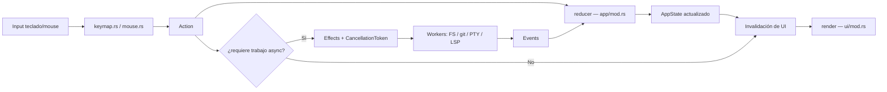
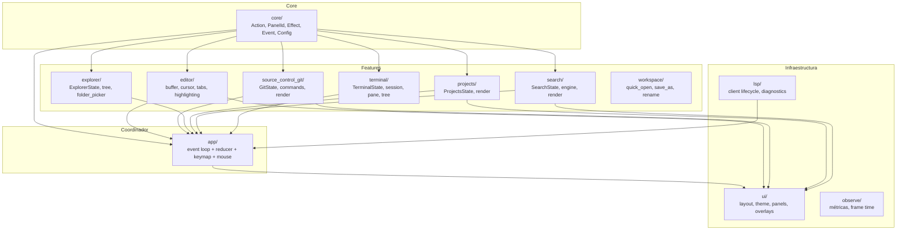

# Architecture — IDE TUI en Rust (RAM/CPU First)

## 1. Objetivos de arquitectura

- sostener input fluido y render predecible
- mantener memoria acotada y explicable por módulo
- habilitar UX moderna sin convertir la TUI en un motor visual caro
- permitir crecimiento por capacidades opt-in
- separar claramente core, UI, workers y servicios externos

## 2. Principios no funcionales

- **performance:** idle casi nulo, render incremental, workers con backpressure
- **estabilidad:** fallas aisladas, cancelación explícita, shutdown limpio
- **mantenibilidad:** módulos pequeños, contratos claros, estado central explícito
- **observabilidad:** métricas desde fase 0, no al final
- **extensibilidad:** command system primero; plugins después y fuera de proceso

## 3. Estructura de módulos actual

El proyecto vive en un único crate (`ide-tui`) con módulos internos organizados por **feature/dominio** — cada feature tiene su estado y su render en la misma carpeta.

```
src/
├── main.rs                    — entry point, bootstrap, wiring
│
├── core/                      — tipos compartidos globales
│   ├── mod.rs                 — Action, PanelId, Effect, Event, AppConfig
│   ├── command.rs             — CommandRegistry, command palette
│   ├── settings.rs            — config, keybindings persistidos
│   ├── ids.rs                 — tipos de ID reutilizables
│   └── budgets.rs             — constantes de RAM/CPU/latencia
│
├── app/                       — coordinador central (event loop + reducer)
│   ├── mod.rs                 — AppState, event loop, reducer monolítico
│   ├── keymap.rs              — mapeo de KeyEvent → Action por contexto
│   ├── mouse.rs               — hit-testing y eventos de mouse
│   └── helpers.rs             — utilidades del reducer (workspace root, etc.)
│
├── editor/                    — panel Editor
│   ├── mod.rs                 — EditorState, DiffViewContent (tab virtual)
│   ├── buffer.rs              — TextBuffer, lectura/escritura de archivos
│   ├── cursor.rs              — CursorState, movimiento, coordenadas
│   ├── tabs.rs                — TabState, TabInfo, open/close/switch
│   ├── highlighting.rs        — syntect highlighting pipeline
│   ├── ts_highlight.rs        — tree-sitter highlighting engine
│   ├── multicursor.rs         — MultiCursorState, Ctrl+D
│   ├── selection.rs           — selección de texto, rangos
│   ├── search.rs              — búsqueda local en buffer
│   ├── brackets.rs            — bracket matching
│   ├── indent.rs              — auto-indent
│   ├── undo.rs                — UndoStack
│   └── viewport.rs            — Viewport, scroll, dimensiones visibles
│
├── source_control_git/        — panel Source Control (Git)
│   ├── mod.rs                 — GitState, stage/unstage/discard/diff methods
│   ├── commands.rs            — wrappers sobre el binario git (CLI)
│   ├── branch_picker.rs       — BranchPicker state
│   └── render.rs              — render del panel, filas con [+]/[-]/[↺], diff view
│
├── explorer/                  — panel Explorer
│   ├── mod.rs                 — ExplorerState, navegación de árbol
│   ├── tree.rs                — FlatEntry, expansión lazy de directorios
│   └── folder_picker.rs       — FolderPickerState, selector de carpetas
│
├── projects/                  — panel Projects
│   ├── mod.rs                 — ProjectsState, lista de workspaces guardados
│   ├── project.rs             — Project struct, metadata de workspace
│   └── render.rs              — render del panel de proyectos
│
├── search/                    — panel Search
│   ├── mod.rs                 — SearchState, query, resultados, filtros
│   ├── engine.rs              — motor de búsqueda (ripgrep adapter + fallback)
│   └── render.rs              — render del panel de búsqueda global
│
├── terminal/                  — panel Terminal
│   ├── mod.rs                 — TerminalState, multi-pane, spawn/focus
│   ├── session.rs             — TerminalSession con alacritty_terminal + portable-pty
│   ├── pane.rs                — TerminalPane (id + session + rect)
│   ├── tree.rs                — PaneTree recursivo para splits H/V
│   ├── input.rs               — key_to_bytes: KeyEvent → secuencias ANSI puras
│   └── renderer.rs            — Term grid → ratatui Lines con colores ANSI
│
├── lsp/                       — Language Server Protocol
│   └── mod.rs                 — LspState, client lifecycle, diagnósticos, completion
│
├── observe/                   — observabilidad y métricas
│   └── mod.rs                 — frame time, latencia, contadores por subsistema
│
├── workspace/                 — utilidades de workspace (modales, quick open)
│   ├── mod.rs                 — re-exports de QuickOpenState
│   ├── quick_open.rs          — QuickOpenState, GoToLineState, fuzzy search de archivos
│   ├── save_as.rs             — SaveAsState (modal para buffers untitled)
│   └── rename.rs              — RenameState (modal de rename en explorer)
│
└── ui/                        — infraestructura de render compartida
    ├── mod.rs                 — render principal, composición de paneles, layout
    ├── layout.rs              — IdeLayout, cálculo de Rect por panel
    ├── panels.rs              — render del editor, tab bar, gutter, status bar (74KB — a partir)
    ├── theme.rs               — Theme, colores semánticos, estilos
    ├── icons.rs               — íconos de archivos por extensión
    ├── context_menu.rs        — ContextMenuState + render
    ├── branch_picker.rs       — render del branch picker
    ├── palette.rs             — render de la command palette
    ├── quick_open.rs          — render del quick open (Ctrl+P)
    ├── go_to_line.rs          — render del go-to-line modal
    ├── save_as_modal.rs       — render del modal save as
    ├── rename_modal.rs        — render del modal rename
    └── settings_panel.rs      — render del panel de settings
```

### Convención de co-ubicación

Cada feature tiene su **estado** y su **render** en la misma carpeta:

| Feature | Estado | Render |
|---------|--------|--------|
| Source Control | `source_control_git/mod.rs` | `source_control_git/render.rs` |
| Explorer | `explorer/mod.rs` | `ui/panels.rs` (sección explorer) |
| Projects | `projects/mod.rs` | `projects/render.rs` |
| Search | `search/mod.rs` | `search/render.rs` |
| Terminal | `terminal/mod.rs` | `terminal/renderer.rs` |
| Editor | `editor/mod.rs` | `ui/panels.rs` (sección editor) |

`ui/mod.rs` actúa como orquestador de render — compone todos los paneles en el frame final. Los renders específicos de feature se re-exportan desde `ui/mod.rs` para mantener compatibilidad de paths.

## 4. Event loop, scheduling y message passing

Modelo principal:

- **UI thread único** para input, reducción de estado y render scheduling
- **workers dedicados** para filesystem, grep, Git, terminal IO y LSP
- **message bus tipado** con eventos de entrada y efectos de salida

Flujo:

```
crossterm input → Action → reducer (app/mod.rs) → Effects → workers → Event → reducer → invalidation → render
```

Reglas:

- prioridad: `input > render > FS/Git visible > terminal visible > search > LSP/indexación`
- colas limitadas por servicio (bounded channels, nunca unbounded)
- tareas cancelables por `CancellationToken`
- debounce para search, palette y LSP
- ningún worker empuja renders directos; sólo emite eventos

## 5. State management

`AppState` (en `app/mod.rs`) agrega todos los estados de feature:

```rust
pub struct AppState {
    pub focused_panel: PanelId,
    pub sidebar_visible: bool,
    pub bottom_panel_visible: bool,
    pub tabs: TabState,              // editor tabs
    pub git: GitState,               // source control
    pub explorer: Option<ExplorerState>,
    pub projects: ProjectsState,
    pub folder_picker: FolderPickerState,
    pub search: SearchState,
    pub terminal: TerminalState,
    pub lsp: LspState,
    pub save_as: SaveAsState,
    pub rename: RenameState,
    // ...overlays, palettes, etc.
}
```

Principios:

- estado central explícito — sin estado oculto en widgets
- normalizar entidades por ID
- evitar clones completos de buffers/resultados
- cache sólo de vistas visibles o recientes
- estado derivado de UI calculado en el borde del render, no persistido

## 6. Navegación entre paneles (100% teclado + mouse)

El ciclo de foco es **dinámico** — depende de qué paneles están visibles:

```
[panel activo en sidebar] ↔ Editor ↔ Terminal (si visible)
```

Atajos de navegación directa:

| Atajo | Acción |
|-------|--------|
| `Tab` / `Shift+Tab` | Ciclo entre paneles visibles |
| `Ctrl+Shift+E` | Foco directo al Explorer |
| `Ctrl+Shift+G` | Foco directo al Source Control |
| `Ctrl+Shift+F` | Foco directo a Search |
| `Ctrl+B` | Toggle sidebar |
| `Ctrl+J` | Toggle bottom panel (terminal) |
| `Ctrl+\`` | Toggle terminal con spawn automático |
| `Esc` en Explorer | Volver al Editor |
| `Esc` en Terminal | Volver al Editor |
| `Ctrl+W` | Cerrar tab activa → foco al Explorer si era la última |

## 7. Render pipeline con `ratatui`

Pipeline por frame:

1. reducer marca regiones inválidas
2. `ui/mod.rs` compone solo paneles visibles
3. cada panel renderiza desde estado derivado liviano (pre-computado fuera del render_widget)
4. frame final se envía por `ratatui`

Reglas de render estrictas (del skill `rust-best-practices`):

- **NUNCA** `format!()` dentro de render loops — pre-computar strings antes del render
- **NUNCA** alocar dentro del `render_widget()` call
- viewport virtual en editor, explorer, search y terminal — solo filas visibles
- throttling suave en eventos verbosos de terminal/search

## 8. Terminal — alacritty_terminal + portable-pty

La terminal usa:

- **`portable-pty`** — spawn de shell real (PowerShell/cmd en Windows, bash/zsh en Unix)
- **`alacritty_terminal::Term<VoidListener>`** — emulador VT/ANSI completo (screen buffer, colores, alternate screen)
- **`vte::ansi::Processor`** — parser de bytes del PTY hacia el Term
- **`PaneTree`** — árbol recursivo de splits horizontal/vertical

Flujo de input al PTY:

```
KeyEvent → key_to_bytes() → SmallVec<[u8;8]> → writer del PTY → shell
```

Flujo de output del PTY:

```
PTY reader thread → bounded channel → poll_output() → Processor::advance() → Term grid → render
```

## 9. Source Control — modelo de diff como tab virtual

El diff de git se abre como una **tab virtual** en el editor (no como overlay bloqueante):

- `EditorState::diff_view: Option<DiffViewContent>` — marca una tab como read-only/diff
- `TabState::open_diff_tab()` — abre o reutiliza tab existente para el mismo archivo
- Título en tab bar: `DIFF: archivo.rs` o `FILE: archivo.rs`
- `Ctrl+W` cierra la tab de diff como cualquier otra tab
- Scroll con `↑/↓` cuando la tab de diff está activa

## 10. Theming

La estética se resuelve con:

- palette fija y precomputada en `ui/theme.rs`
- tokens semánticos: `accent`, `warning`, `muted`, `selection`, `diff_add`, `diff_remove`, `fg_error`, `bg_active`
- bordes diferenciados: `border_focused` (cyan, double) vs `border_unfocused` (gris, plain)
- cero gradientes, cero animaciones por frame

## 11. Budgets de performance

| Métrica | Target | Hard limit |
|---------|--------|-----------|
| Idle RAM (sin LSP) | < 40 MB | — |
| RAM en uso normal | < 70 MB | < 100 MB |
| Input-to-render | < 16 ms | < 33 ms |
| CPU idle | ~0-1% | — |
| Cold startup | < 150 ms | — |

Reglas inviolables en código:

- **NUNCA** `.clone()` sin comentario `// CLONE: {razón}`
- **NUNCA** `unwrap()`/`expect()` en producción
- **NUNCA** canales unbounded
- **NUNCA** `tokio::spawn` sin `CancellationToken`
- **NUNCA** alocar dentro de render loops

## 12. Git / Source Control — alcance implementado

### Implementado (MVP+)

- snapshot de `git status` con refresh manual y automático
- panel de cambios con secciones Staged / Changes
- diff por archivo como tab virtual en el editor
- stage/unstage por archivo individual (`[+]`/`[-]` inline)
- discard por archivo (`[↺]` inline — `git restore` o `git clean -f` según tipo)
- stage all (`[+]` en header Changes)
- unstage all (`[-]` en header Staged)
- commit básico con input siempre visible (VS Code style)
- branch picker
- fetch

### Post-MVP

- stage por hunk
- blame bajo demanda sobre línea actual
- historial por archivo

## 13. Diagramas de referencia

### 13.1 Flujo de eventos



### 13.2 Estructura de módulos



### 13.3 Dependencias entre módulos (regla de capas)

```
core/           ← sin dependencias externas (base)
editor/         ← depende de core
source_control_git/ ← depende de core
explorer/       ← depende de core
projects/       ← depende de core
search/         ← depende de core
terminal/       ← depende de core
lsp/            ← depende de core, editor
ui/             ← depende de todos los anteriores (solo render)
app/            ← depende de todos (coordinador)
```

Regla: las capas de dominio (`editor`, `source_control_git`, etc.) son **puras** — no dependen entre sí ni de `ui/`. Solo `ui/` y `app/` tienen visibilidad de todos los módulos.

## 14. Deuda técnica conocida

| Item | Archivo | Impacto |
|------|---------|---------|
| Reducer monolítico | `app/mod.rs` (2500+ líneas) | Alto — cada feature nueva agranda el archivo |
| Render editor monolítico | `ui/panels.rs` (74KB) | Medio — difícil de navegar |
| `app/keymap.rs` sin partir | `app/keymap.rs` (1085 líneas) | Medio |
| `workspace/` con nombre ambiguo | `workspace/` | Bajo — renombrar a `editor_utils/` o mover a `editor/` |

Próximos refactors planeados:

1. Partir `app/mod.rs` → `app/reducers/{editor,source_control,terminal,search,ui}.rs`
2. Partir `ui/panels.rs` → `ui/editor_panel.rs`, `ui/tab_bar.rs`, `ui/status_bar.rs`
3. Mover `workspace/save_as.rs` y `workspace/rename.rs` → `editor/`
