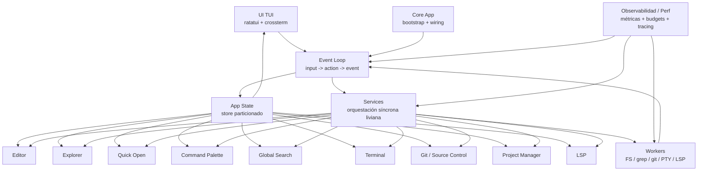
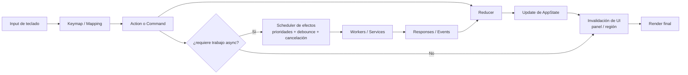
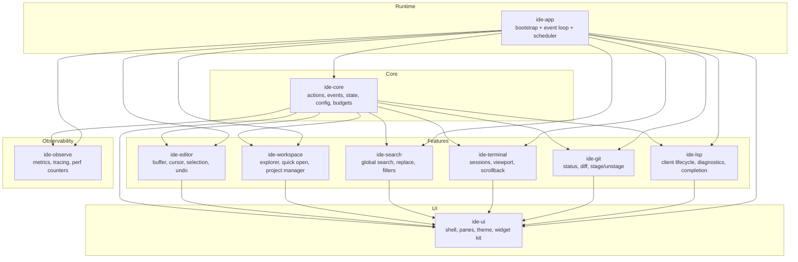

# Architecture — IDE TUI en Rust (RAM/CPU First)

## 1. Objetivos de arquitectura

- sostener input fluido y render predecible
- mantener memoria acotada y explicable por módulo
- habilitar UX moderna sin convertir la TUI en un motor visual caro
- permitir crecimiento por capacidades opt-in
- separar claramente core, UI, workers y servicios externos

## 2. Principios no funcionales

- **performance:** idle casi nulo, render incremental, workers con backpressure
- **estabilidad:** fallas aisladas, cancelación explícita, shutdown limpio
- **mantenibilidad:** módulos pequeños, contratos claros, estado central explícito
- **observabilidad:** métricas desde fase 0, no al final
- **extensibilidad:** command system primero; plugins después y fuera de proceso

## 3. Diseño propuesto del workspace/crates

No se crea todavía el esqueleto, pero la arquitectura objetivo es esta:

- `ide-core`: tipos compartidos, acciones, eventos, budgets, config, IDs
- `ide-app`: bootstrap, event loop, scheduler, wiring general
- `ide-ui`: composición de panes, foco, render con `ratatui`
- `ide-editor`: buffer model, cursor, selección, multicursor, undo/redo
- `ide-workspace`: explorer, quick open, recientes, project manager
- `ide-search`: search local/global, replace, filtros, adapters externos
- `ide-terminal`: sesiones, IO, scrollback limitado
- `ide-git`: status, diff, stage/unstage, commit básico, blame bajo demanda futuro
- `ide-lsp`: lifecycle de servidores, requests, cancelación, debounce
- `ide-observe`: tracing, counters, timers, budget inspectors

Si el costo de múltiples crates complica demasiado al inicio, se puede arrancar en un crate con módulos internos manteniendo estos límites lógicos. Esa es la alternativa austera.

## 4. Event loop, scheduling y message passing

Modelo principal:

- **UI thread único** para input, reducción de estado y render scheduling
- **workers dedicados** para filesystem, grep, Git, terminal IO y LSP
- **message bus tipado** con eventos de entrada y efectos de salida

Flujo:

`crossterm input -> Action -> reducer/store -> Effects -> workers -> Event -> reducer -> invalidation -> render`

Reglas:

- prioridad: `input > render > FS/Git visible > terminal visible > search > LSP/indexación`
- colas limitadas por servicio
- tareas cancelables por token
- debounce para search, palette y LSP
- ningún worker empuja renders directos; sólo emite eventos

## 5. State management

`AppState` debe ser chico, particionado y orientado a vistas:

- `ui_state`: layout, foco, paneles, overlays, theme
- `workspace_state`: root actual, recientes, explorer visible, open items
- `editor_state`: buffers abiertos, viewport, cursores, selección, dirty flags
- `search_state`: query actual, filtros, resultados visibles, job activo
- `git_state`: snapshot actual, selección, diff visible, op en curso
- `terminal_state`: sesiones visibles, scrollback metadata, proceso activo
- `lsp_state`: sesiones activas, requests pendientes, diagnósticos visibles

Principios:

- normalizar entidades por ID
- evitar clones completos de buffers/resultados
- mantener cache sólo de vistas visibles o recientes
- derivar estado de UI en el borde, no persistir todo como snapshot

## 6. Render pipeline con `ratatui`

Pipeline:

1. reducer marca regiones inválidas
2. UI compone sólo panes visibles
3. cada pane renderiza desde estado derivado liviano
4. frame final se envía por `ratatui`

Decisiones:

- invalidación por panel/región, no redraw conceptual completo
- viewport virtual para editor, explorer, search y terminal
- tabs/status bar con datos ya preparados, no con cómputo en render
- throttling suave de renders en eventos muy verbosos de terminal/search

## 7. Theming moderno/cyberpunk sin costo excesivo

La estética se resuelve con:

- palette fija y precomputada
- tokens semánticos (`accent`, `warning`, `muted`, `selection`, `diff_add`, `diff_remove`)
- bordes, separadores y highlights simples
- cero gradientes, cero animaciones complejas, cero efectos dinámicos por frame

MVP visual:

- un tema oscuro default, VSCode-like/cyberpunk sobrio
- contraste alto en foco, selección y estados Git/search

Post-MVP:

- temas adicionales compatibles con el mismo set de tokens

## 8. Modelo de editor, buffer, cursor y multicursor

### Buffer

Arrancar con una estructura editable medible. Opción preferida: **piece table o rope simple**, elegida por benchmark, no por moda. El buffer debe soportar:

- viewport renderizable
- undo/redo
- búsquedas locales
- posiciones múltiples sin copiar texto innecesariamente

### Cursor y selección

- cursor primario siempre definido
- selección lineal básica primero
- offsets y posiciones convertibles entre índice lógico y línea/columna cacheada localmente

### Multicursor

MVP austero:

- `Ctrl+D` agrega la siguiente coincidencia del texto seleccionado
- múltiples selecciones homogéneas
- edición sincronizada sobre todas las selecciones activas

Post-MVP:

- agregar cursores arbitrarios
- merge/split de selecciones
- operaciones más avanzadas

Esto reduce complejidad inicial: primero coincidencias repetidas, no un sistema universal de edición multidimensional.

## 9. Explorer, Ctrl+P y Command Palette

### File explorer

- árbol lazy por directorio expandido
- ignore básico (`.git`, target, node_modules cuando aplique)
- refresh manual o por eventos puntuales

### Ctrl+P

- índice liviano de paths visibles/conocidos del workspace
- si hace falta completar paths, escaneo cooperativo y cancelable
- ranking simple: exact/prefix > fuzzy > recientes

### Ctrl+Shift+P

- registry central de comandos
- metadata mínima: id, label, aliases, category, enablement
- el palette nunca ejecuta lógica pesada al filtrar; sólo consulta catálogo en memoria

## 10. Global search / replace

Arquitectura recomendada:

- adapter de búsqueda externa rápida cuando esté disponible (por ejemplo, motor tipo ripgrep)
- fallback interno más austero si no existe dependencia externa viable
- resultados en streaming hacia un panel virtualizado

Filtros requeridos:

- match case
- whole word
- regex
- include files
- exclude files

Replace MVP:

- replace por coincidencia seleccionada
- replace por archivo confirmado
- preview básica

Replace diferido:

- replace masivo multiarchivo con preview rica e interacción compleja

## 11. Integración de terminal

- proceso shell en worker/servicio dedicado
- PTY o equivalente detrás de un boundary claro
- scrollback acotado por líneas/bytes
- render sólo del viewport visible
- input directo desde panel enfocado

MVP: una sesión visible y estable.

## 12. Git / Source Control / alcance GitLens-like

### MVP

- snapshot de `git status`
- panel de cambios
- diff básico por archivo
- stage/unstage por archivo
- commit básico

### Post-MVP

- stage por hunk
- navegación editor <-> cambio
- blame bajo demanda sobre línea actual

### Futuro GitLens-like realista

- inline blame opcional
- historial por archivo
- navegación a commit/autores

Decisión clave: nada de blame permanente ni minería histórica continua en background. Eso destruye CPU y mete ruido.

## 13. Project manager

- lista de workspaces recientes
- abrir/cerrar/cambiar proyecto rápido
- metadata mínima persistida: path, nombre, última apertura, layout simple
- no indexa cada proyecto en segundo plano

## 14. LSP austero

- activación lazy por archivo/lenguaje
- requests cancelables
- debounce en cambios
- no guardar modelos semánticos enormes en memoria si el servidor ya los provee
- diagnósticos y completion visibles sólo para buffers activos o recientes

## 15. Extensibilidad futura

Fase 1: comandos internos + config.

Fase 2: hooks limitados.

Fase 3: plugins fuera de proceso con budgets de tiempo/memoria y protocolo estable. Nunca in-process al comienzo.

## 16. Observabilidad y telemetría local

Desde el día 1:

- frame time
- input-to-render latency
- tamaño estimado de buffers y scrollbacks
- longitud de colas por worker
- duración de grep/Git/LSP requests
- drops/cancelaciones/debounces
- memoria estimada por subsistema

Esto debe poder verse en logs y, más adelante, en un panel de diagnóstico interno.

## 17. Riesgos y tradeoffs

| Tema | Opción elegida | Tradeoff |
|---|---|---|
| UX moderna | tokens visuales simples | menos espectacular, mucho más barata |
| Ctrl+P | índice liviano + escaneo cooperativo | ranking menos mágico al inicio |
| Multicursor | coincidencias repetidas primero | menos poder inicial, mucha menos complejidad |
| Search global | on-demand streaming | no hay resultados “instantáneos” universales |
| Git | snapshot y acciones básicas | sin experiencia GitLens completa temprano |
| Terminal | una sesión mínima | menos flexibilidad inicial |

## 18. Qué se implementa primero y por qué

1. observabilidad + event loop + render base
2. editor y buffer sólidos
3. shell visual, explorer y command system
4. `Ctrl+P`, project manager, grep y terminal mínima
5. multicursor austero (`Ctrl+D`)
6. panel Git austero
7. LSP austero

Ese orden protege el núcleo: primero latencia, luego edición, luego flujos de productividad, recién después inteligencia y profundidad.

## 19. Diagramas de referencia

### Suposiciones explícitas

- si el proyecto empieza con un solo crate, estos límites viven primero como módulos internos y recién después se separan en crates
- `ide-app` concentra bootstrap, event loop, scheduler y wiring; no absorbe lógica de dominio pesada
- la UI nunca habla directo con IO pesado: todo pasa por acciones, efectos y workers/servicios
- cuando hay tensión entre “feature rica” y budgets, gana la variante austera y medible

### 19.1 Diagrama de arquitectura general

Sirve para ubicar los límites gruesos del sistema: la UI renderiza, el event loop reduce estado, los servicios coordinan efectos baratos y los workers aíslan IO o cómputo costoso. La decisión RAM/CPU-first acá es CLARA: ninguna feature salta el loop ni fuerza renders directos desde background.

### 19.2 Diagrama de flujo de eventos

Sirve para explicar el contrato operativo del runtime. El punto importante es que el input siempre entra por acciones/comandos, el estado se actualiza en un lugar central y las respuestas async vuelven como eventos; no existen atajos mágicos que mezclen IO con render.

### 19.3 Diagrama de módulos / crates

Sirve para dejar claro dónde vive cada responsabilidad del workspace Rust y cómo se mantienen dependencias sanas: `ide-core` es la base compartida, `ide-ui` concentra shell y theme, `ide-observe` concentra métricas, y las integraciones pesadas (`git`, `lsp`, `terminal`, `search`) quedan separadas del runtime principal. Si al inicio no conviene un workspace multi-crate, esta misma forma se replica como módulos internos con las mismas fronteras.